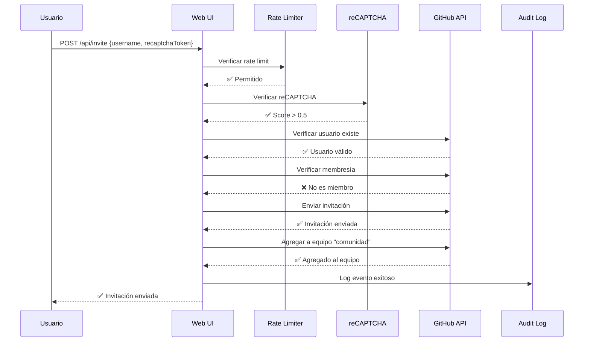
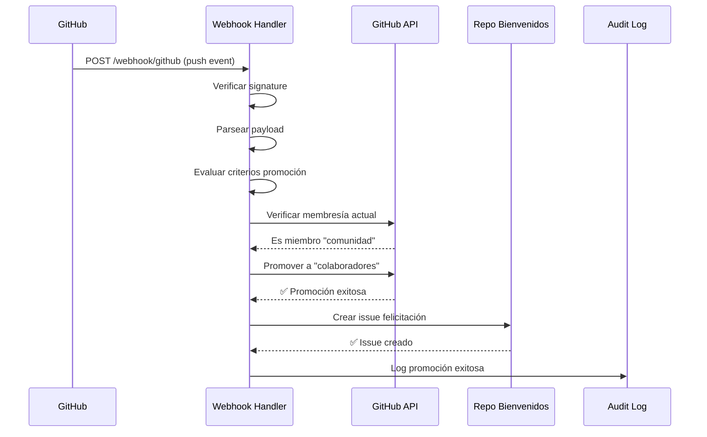

# 🏗️ Arquitectura del Sistema - MeshChile GitHub Bot

Diseño técnico y arquitectural del sistema de invitaciones y promoción automática para la organización GitHub de MeshChile.

## 📊 Visión General del Sistema

```
┌─────────────────┐    ┌─────────────────┐    ┌─────────────────┐
│   Usuario Final │    │  Administrador  │    │ GitHub Webhooks │
└─────────┬───────┘    └─────────┬───────┘    └─────────┬───────┘
          │                      │                      │
          ▼                      ▼                      ▼
┌─────────────────────────────────────────────────────────────────┐
│                    MeshChile GitHub Bot                         │
│  ┌─────────────┐  ┌─────────────┐  ┌─────────────────────────┐  │
│  │   Web UI    │  │ Rate Limiter│  │    Webhook Handler      │  │
│  │  (Express)  │  │  (Express)  │  │    (Auto Promotion)    │  │
│  └─────────────┘  └─────────────┘  └─────────────────────────┘  │
│  ┌─────────────┐  ┌─────────────┐  ┌─────────────────────────┐  │
│  │ reCAPTCHA   │  │   Audit     │  │     GitHub API          │  │
│  │ Validation  │  │   Logger    │  │    (Octokit)            │  │
│  └─────────────┘  └─────────────┘  └─────────────────────────┘  │
└─────────────────────────────────────────────────────────────────┘
          │                      │                      │
          ▼                      ▼                      ▼
┌─────────────────┐    ┌─────────────────┐    ┌─────────────────┐
│   GitHub API    │    │   File System   │    │   reCAPTCHA     │
│  Organization   │    │   (Logs)        │    │   Service       │
└─────────────────┘    └─────────────────┘    └─────────────────┘
```

## 🧩 Componentes del Sistema

### 1. Core Application (server.js)

**Responsabilidades:**
- Servidor HTTP Express
- Routing y middleware management
- Orchestración de componentes
- Error handling global

**Tecnologías:**
- Node.js 16+
- Express.js 4.18+
- Middleware stack personalizado

### 2. GitHub Integration Layer

**Componentes:**
```javascript
// Octokit REST API Client
const octokit = new Octokit({
    auth: process.env.GITHUB_TOKEN
});

// Funciones principales:
- inviteUserToOrganization()
- promoteUserToCollaborator() 
- sendCongratulationsMessage()
- handlePromotionEvent()
```

**Endpoints GitHub utilizados:**
- `GET /users/{username}` - Verificar usuario
- `POST /orgs/{org}/invitations` - Enviar invitación
- `GET /orgs/{org}/memberships/{username}` - Verificar membresía
- `PUT /orgs/{org}/teams/{team}/memberships/{username}` - Gestionar equipos
- `POST /repos/{owner}/{repo}/issues` - Crear issues de felicitación

### 3. Rate Limiting System

**Arquitectura de múltiples límites:**
```javascript
// Limiter específico para invitaciones
inviteLimiter: {
    windowMs: 15 * 60 * 1000,  // 15 minutos
    max: 3,                    // 3 requests por IP
    handler: customRateLimitHandler
}

// Limiter general
generalLimiter: {
    windowMs: 1 * 60 * 1000,   // 1 minuto  
    max: 20,                   // 20 requests por IP
}
```

**Estrategia por entorno:**
- **Test**: Límites muy altos para testing
- **Development**: Límites relajados para debugging
- **Production**: Límites estrictos para seguridad

### 4. Security Layer

**Componentes de seguridad:**

**reCAPTCHA v3 Validation:**
```javascript
verifyRecaptcha(token, userIP) {
    - Verificar token con Google API
    - Validar score (> 0.5)
    - Verificar acción ('github_invite')
    - Logging de intentos
}
```

**Webhook Signature Verification:**
```javascript
verifyWebhookSignature(payload, signature) {
    const expectedSignature = 'sha256=' + crypto
        .createHmac('sha256', WEBHOOK_SECRET)
        .update(payload)
        .digest('hex');
}
```

**Input Validation:**
- Username regex validation
- JSON schema validation
- SQL injection prevention (aunque no usa DB)

### 5. Audit & Logging System

**Estructura del audit log:**
```javascript
auditLog(action, username, ip, success, message) {
    timestamp: ISO8601,
    action: string,
    username: string,
    ip: string,
    success: boolean,
    message: string,
    environment: NODE_ENV
}
```

**Tipos de eventos loggeados:**
- `INVITE_ATTEMPT` - Intentos de invitación
- `INVITE_SUCCESS` - Invitaciones exitosas
- `INVITE_ERROR` - Errores de invitación
- `PROMOTION_SUCCESS` - Promociones automáticas
- `ADMIN_PROMOTE` - Promociones manuales
- `WEBHOOK_RECEIVED` - Webhooks procesados

## 🔄 Flujos de Trabajo

### Flujo de Invitación de Usuario



### Flujo de Promoción Automática



## 📦 Estructura de Datos

### Request/Response Schemas

**POST /api/invite Request:**
```json
{
  "username": "string (required, regex: /^[a-z\d](?:[a-z\d]|-(?=[a-z\d])){0,38}$/i)",
  "recaptchaToken": "string (required if reCAPTCHA enabled)"
}
```

**POST /api/invite Response (Success):**
```json
{
  "success": true,
  "message": "Invitación enviada exitosamente a {username}",
  "user": {
    "username": "string",
    "name": "string",
    "avatar": "string"
  },
  "teamAssigned": boolean
}
```

**Webhook Event Payload:**
```json
{
  "action": "created|opened|pushed",
  "sender": {
    "login": "string"
  },
  "repository": {
    "owner": {
      "login": "string"
    }
  },
  "commits": [...] // Para push events
}
```

## 🔐 Modelo de Seguridad

### Autenticación y Autorización

**GitHub Token Scopes:**
```yaml
repo:
  - issues:write (crear issues felicitación)
  - metadata:read (leer info repositorios)
  
write:org:
  - members:write (gestionar membresías)
  - teams:write (gestionar equipos)
  
admin:org_hook:
  - hooks:read (verificar webhooks)
```

**Rate Limiting Strategy:**
- **IP-based**: Prevenir ataques por volumen
- **Progressive**: Diferentes límites por endpoint
- **Environment-aware**: Más permisivo en desarrollo

**Input Sanitization:**
- Username format validation
- JSON payload size limits (10MB)
- XSS prevention en responses
- Webhook signature verification

### Threat Model

**Amenazas Consideradas:**
1. **Spam de invitaciones** → Rate limiting + reCAPTCHA
2. **Bot attacks** → reCAPTCHA v3 con score threshold
3. **Webhook spoofing** → HMAC signature verification
4. **Privilege escalation** → Token scopes mínimos necesarios
5. **Information disclosure** → Error messages sanitizados

## 🚀 Escalabilidad

### Performance Characteristics

**Request Throughput:**
- **Development**: ~1000 req/min por instancia
- **Production**: ~20 req/min por IP (rate limited)
- **Webhook processing**: ~100 events/min

**Memory Usage:**
- **Baseline**: ~50MB
- **Peak**: ~100MB (con concurrent requests)
- **Scalable**: Stateless architecture

### Scaling Strategies

**Horizontal Scaling:**
```yaml
# Docker Swarm / Kubernetes
replicas: 3
strategy: rolling_update
load_balancer: nginx/traefik
session_affinity: none  # stateless
```

**Vertical Scaling:**
- **CPU**: Single-threaded, no CPU-intensive tasks
- **Memory**: Minimal memory footprint
- **Network**: GitHub API rate limits son el bottleneck

### Monitoring Points

**Health Checks:**
- `GET /api/bot/status` - Application health
- Process uptime monitoring
- GitHub API connectivity
- Webhook delivery success rate

**Metrics to Track:**
- Request latency (p50, p95, p99)
- Error rates por endpoint
- Rate limit hit rates
- GitHub API quota usage
- Webhook processing time

## 🧪 Testing Architecture

### Test Strategy

**Unit Tests:**
- Individual function testing
- Mock GitHub API responses
- Rate limiter behavior
- Input validation logic

**Integration Tests:**
- End-to-end request flows
- Webhook event processing
- Error handling scenarios
- Security validation

**Performance Tests:**
- Rate limiting effectiveness
- Concurrent request handling
- Memory leak detection

### Test Environment

```javascript
// Test configuration automática
process.env.NODE_ENV = 'test';
process.env.GITHUB_ORG = 'test-org';
process.env.COMMUNITY_TEAM = 'test-comunidad';

// Rate limits relajados para testing
max: 1000,
windowMs: 1000
```

## 📚 Decisiones Arquitecturales

### Por qué Express.js
- **Simplicidad**: API REST straightforward
- **Ecosystem**: Rich middleware ecosystem
- **Performance**: Sufficient para use case
- **Familiaridad**: Team knowledge

### Por qué No Database
- **Simplicity**: GitHub es la fuente de verdad
- **Stateless**: Easier scaling y deployment
- **Maintenance**: No DB maintenance overhead
- **Cost**: Reduced infrastructure costs

### Por qué reCAPTCHA v3
- **UX**: Invisible para usuarios legítimos
- **Accuracy**: Score-based detection
- **Integration**: Simple API integration

### Por qué Rate Limiting Agresivo
- **GitHub API Limits**: Preserve quota
- **Abuse Prevention**: Prevent spam
- **Resource Protection**: Server resources

---

**🏗️ Arquitectura**: Microservicio stateless  
**🔧 Patrón**: Event-driven with webhooks  
**🛡️ Seguridad**: Defense in depth  
**📈 Escalabilidad**: Horizontal scaling ready
